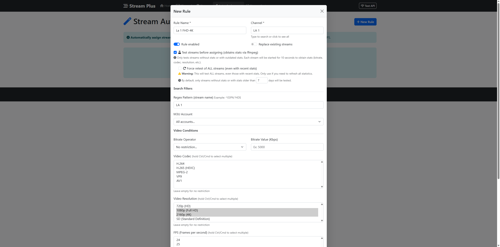
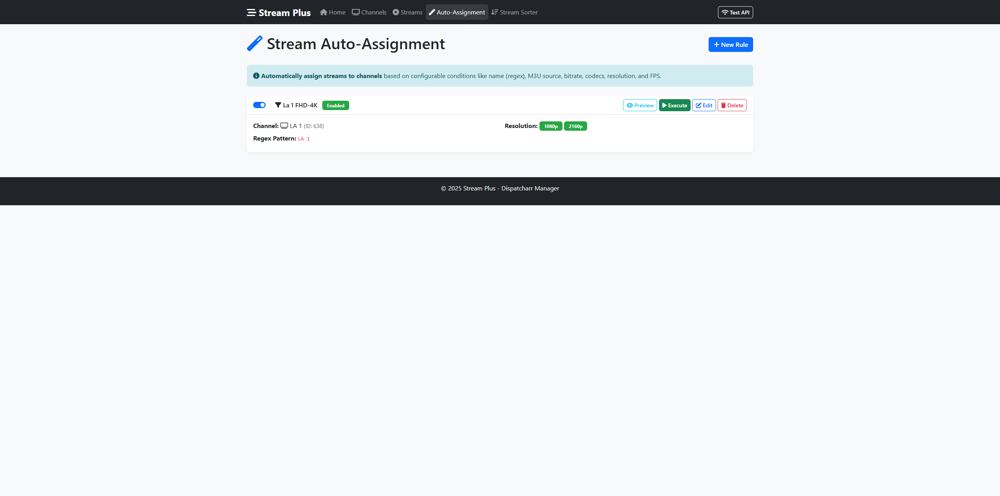
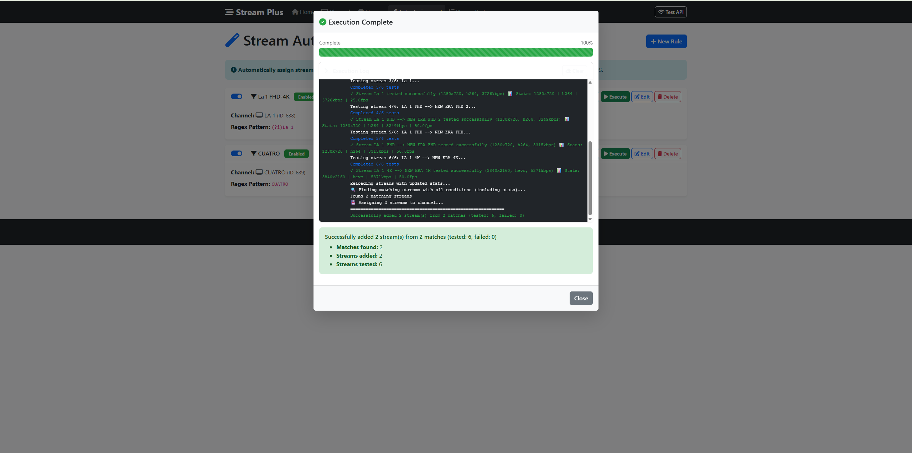
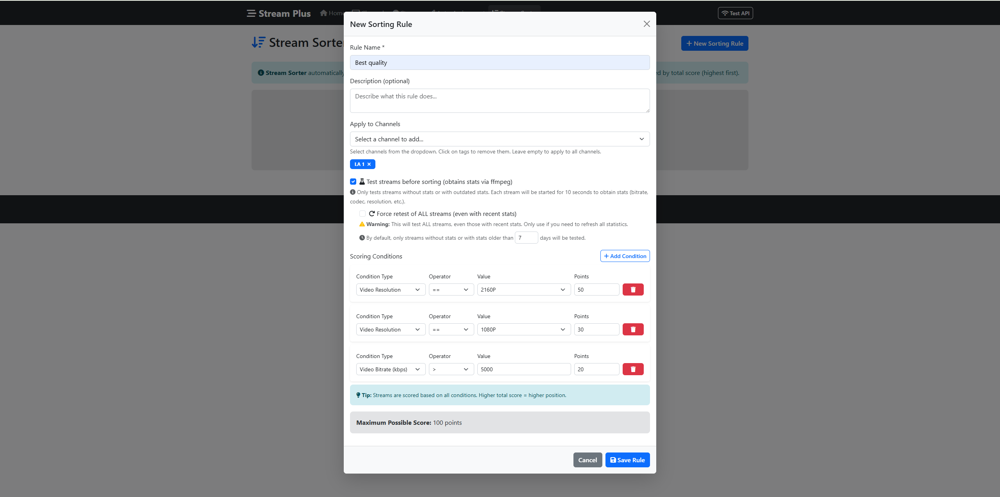
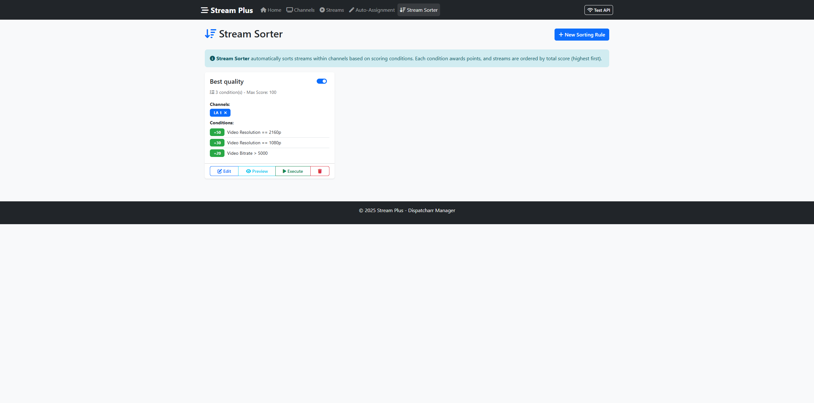
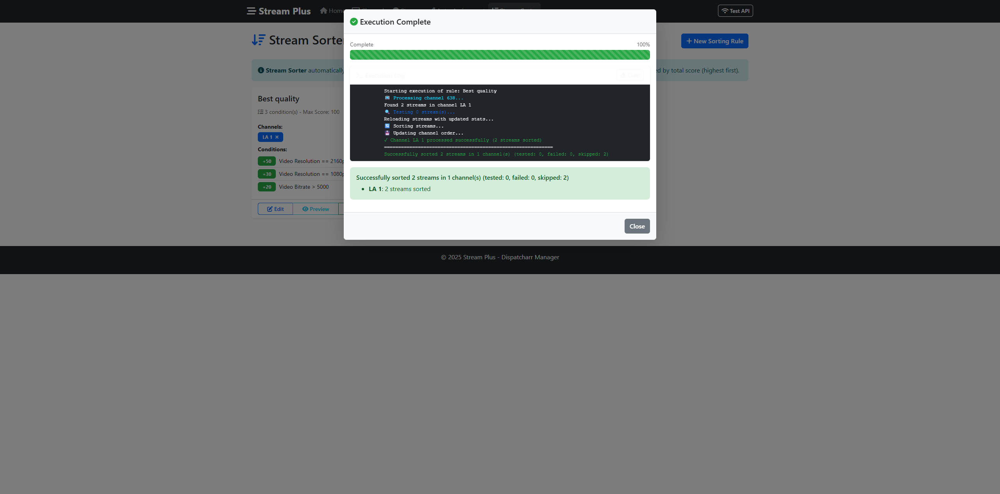
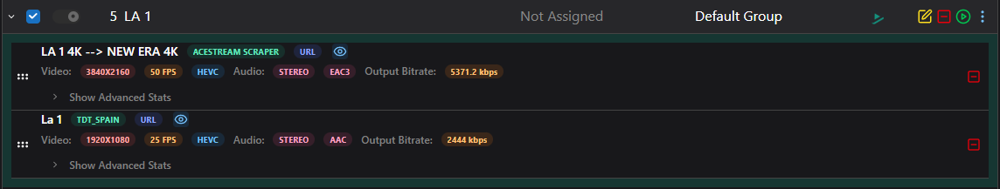

# Stream Plus

Web application for managing Dispatcharr channels and streams with intelligent auto-assignment and stream sorting capabilities.

**Version:** v0.2.2 | **Release Date:** October 13, 2025

## Features

- 🎯 **Channel & Stream Management**: Complete CRUD operations via web interface
- 🔍 **Advanced Search & Filtering**: Real-time search and filter auto-assignment rules by channel name or rule name
- 🤖 **Auto-Assignment Rules**: Automatically assign streams to channels based on quality criteria with support for multiple M3U accounts
- 🏆 **Stream Sorter**: Score-based stream ordering with multi-condition rules that can apply to all channels or specific ones
- 🎨 **Modern UI**: Responsive Bootstrap 5 interface with comprehensive preview functionality and improved user experience

## Screenshots

### Auto-Assignment Rule Creation Form


### Auto-Assignment Rules View


### Executing Auto-Assignment Rule


### Stream Sorting Rule Form


### Stream Sorting Rules View


### Stream Sorting Rule Preview


### Executing Stream Sorting Rule


### Result in Dispatcharr


## Quick Start (Docker)

### Production (Recommended)

Create a `docker-compose.yml` file with the following content:

```yaml
services:
  stream-plus:
    image: bernouilli/stream-plus:latest
    container_name: stream-plus
    restart: unless-stopped
    
    environment:
      # ===== REQUIRED: Dispatcharr API Configuration =====
      # URL where your Dispatcharr instance is running
      - DISPATCHARR_API_URL=http://127.0.0.1:9191
      # Username for Dispatcharr API authentication
      - DISPATCHARR_API_USER=user
      # Password for Dispatcharr API authentication
      - DISPATCHARR_API_PASSWORD=password
      
      # ===== OPTIONAL: Flask Application Settings =====
      # Port where the web interface will be accessible
      - PORT=5000
      # Enable/disable Flask debug mode (keep false in production)
      - FLASK_DEBUG=false
      # Secret key for session management (change in production!)
      - SECRET_KEY=change-this-secret-key-in-production
      
      # ===== OPTIONAL: Stream Testing Configuration =====
      # Duration in seconds to test each stream (default: 10)
      - STREAM_TEST_DURATION=10
      # Additional timeout buffer for stream testing (default: 30)
      - STREAM_TEST_TIMEOUT_BUFFER=30
      # Delay in seconds between consecutive stream tests to avoid provider detection (default: 3)
      - STREAM_TEST_DELAY=3
      
      # ===== OPTIONAL: System Configuration =====
      # Timezone for the container (affects logs and scheduling)
      - TZ=Europe/Madrid
    
    ports:
      # Map container port 5000 to host port 5000
      - "5000:5000"
    
    volumes:
      # Persist rules and configuration data
      - ./rules:/app/rules
    
    healthcheck:
      # Health check to ensure the application is running
      test: ["CMD", "curl", "-f", "http://localhost:5000/"]
      interval: 30s
      timeout: 10s
      retries: 3
      start_period: 40s
```

Then start the container:

```bash
# Start the container in detached mode
docker-compose up -d

# Access the web interface at http://localhost:5000
```

### Development

```bash
# 1. Clone repository
git clone https://github.com/bernouilli90/Stream-plus.git
cd Stream-plus

# 2. Configure Dispatcharr credentials in docker-compose.dev.yml
nano docker-compose.dev.yml

# 3. Build and start container
docker-compose -f docker-compose.dev.yml up -d

# Access at http://localhost:5000
```

### Manual Build

```bash
# 1. Clone repository
git clone https://github.com/bernouilli90/Stream-plus.git
cd Stream-plus

# 2. Build image manually
./docker-build.sh

# 3. Configure Dispatcharr credentials in docker-compose.yml
nano docker-compose.yml

# 4. Start container
docker-compose up -d

# Access at http://localhost:5000
```

## Manual Installation

```bash
# Clone repository
git clone https://github.com/bernouilli90/Stream-plus.git
cd Stream-plus

# Create virtual environment
python -m venv venv
source venv/bin/activate

# Install dependencies
pip install -r requirements.txt

# Configure environment
cp .env.example .env
nano .env  # Set DISPATCHARR_API_URL, DISPATCHARR_API_USER, DISPATCHARR_API_PASSWORD

# Run application
python app.py
```

## Configuration

### Required Environment Variables

```env
DISPATCHARR_API_URL=http://dispatcharr:8080
DISPATCHARR_API_USER=admin
DISPATCHARR_API_PASSWORD=yourpassword
```

### Optional Variables

```env
# Web Interface
PORT=5000
FLASK_DEBUG=False
SECRET_KEY=your-secret-key

# Stream Testing Configuration
STREAM_TEST_DURATION=10          # Duration in seconds to test each stream
STREAM_TEST_TIMEOUT_BUFFER=30    # Additional timeout buffer for testing
STREAM_TEST_DELAY=3              # Delay in seconds between consecutive stream tests

# System
TZ=UTC                          # Timezone for logs and scheduling
```

## Docker Images

### Official Images

Pre-built Docker images are available on Docker Hub:

- **Production**: `bernouilli/stream-plus:latest` - Latest stable release
- **Development**: Build from source using `docker-compose.dev.yml`

### Image Features

- **Alpine Linux** base for minimal size
- **FFmpeg & FFprobe** included for stream analysis
- **Curl** included for health checks
- **Non-root user** (UID/GID 1000) for security
- **Health checks** for container monitoring
- **Timezone support** via TZ environment variable

### Docker Compose Files

- **`docker-compose.yml`**: Uses pre-built image from Docker Hub (recommended for production)
- **`docker-compose.dev.yml`**: Builds image from source (recommended for development)

## Auto-Assignment Rules

Create rules to automatically assign streams to channels based on criteria:

- **Stream name patterns**: Match by name/regex
- **M3U Accounts**: Select multiple accounts or all accounts for broader matching
- **Video resolution**: 2160p, 1080p, 720p, SD (&lt; 720p)
- **Video codec**: h264, h265, av1
- **Audio codec**: aac, ac3, eac3
- **Video FPS**: Frame rate matching
- **Bitrate**: Quality thresholds

**Advanced Options:**
- **Replace existing streams**: Choose whether to replace current streams or add new ones
- **Stream testing before assignment**: Automatically test streams using FFmpeg to obtain real statistics (bitrate, codec, resolution, etc.)
- **Force retest**: Option to retest streams even with recent statistics
- **Test age threshold**: Configure how old statistics can be before requiring retest

**Search & Filter:**
- **Real-time search**: Filter rules instantly by typing channel names or rule names
- **Case-insensitive matching**: Search works regardless of letter case
- **Dynamic counter**: Shows "X of Y rules" as you filter
- **Clear filter**: One-click button to reset the search

**Example rule with advanced options:**
```json
{
  "name": "Premium HD Sports",
  "enabled": true,
  "channel_id": 123,
  "m3u_account_ids": [1, 3],
  "replace_existing_streams": true,
  "regex_pattern": ".*(?:ESPN|FOX|NBC).*HD.*",
  "video_resolution": ["1080p", "720p"],
  "video_codec": ["h265", "h264"],
  "video_bitrate_operator": ">=",
  "video_bitrate_value": 4000,
  "test_streams_before_sorting": true,
  "force_retest_old_streams": false,
  "retest_days_threshold": 7
}
```

## Stream Sorting

Score and reorder streams within channels based on quality metrics. Rules can apply to specific channels or all channels in your system.

**Scoring Conditions:**
- M3U Source account
- Video bitrate (>, >=, <, <=, ==)
- Video resolution (2160p, 1080p, 720p, SD &lt; 720p)
- Video codec
- Audio codec
- Video FPS

**Rule Scope Options:**
- **Specific channels**: Apply to selected individual channels or channel groups
- **All channels**: Apply the sorting rule to every channel in your Dispatcharr instance

**Example:**
```
Rule: "Best Quality First" (Applies to ALL channels)
Conditions:
  - Video Bitrate >= 5000 → 10 points
  - Resolution >= 1920 → 15 points
  - Codec == "h265" → 8 points
```

Streams are reordered by total score (highest first).

## Rule Preview & Testing

Test your rules before applying them to avoid unexpected results:

### Auto-Assignment Rules
- **Comprehensive preview**: Shows all streams that match your criteria across all selected M3U accounts
- **Stream details**: Displays M3U source, audio codec, bitrate, resolution, and FPS for each matching stream
- **Channel validation**: Verifies that the target channel exists before allowing rule execution

### Stream Sorting Rules
- **Channel selection**: Preview how sorting rules affect specific channels
- **Score breakdown**: See how each stream scores against your conditions
- **All channels support**: Preview rules that apply to all channels by selecting any channel for testing

## CLI Rule Execution

Execute rules from command line or cron:

```bash
# Execute all rules
docker exec stream-plus python execute_rules.py --all

# Assignment rules only
docker exec stream-plus python execute_rules.py --assignment

# Sorting rules only
docker exec stream-plus python execute_rules.py --sorting

# Specific rule by ID
docker exec stream-plus python execute_rules.py --all --rule-ids 2 --verbose
```

### Automation with Cron

```bash
# Execute all rules every hour
0 * * * * docker exec stream-plus python execute_rules.py --all >> /var/log/stream-plus.log 2>&1
```

## Docker Deployment

### Build with Custom UID/GID

```bash
docker build \
  --build-arg USER_UID=$(id -u) \
  --build-arg USER_GID=$(id -g) \
  -t stream-plus:latest .
```

### Data Persistence

Rule files persist in `./rules/` directory:
- `auto_assignment_rules.json` - Assignment rules
- `sorting_rules.json` - Sorting rules

Files are auto-created with empty structure if missing.